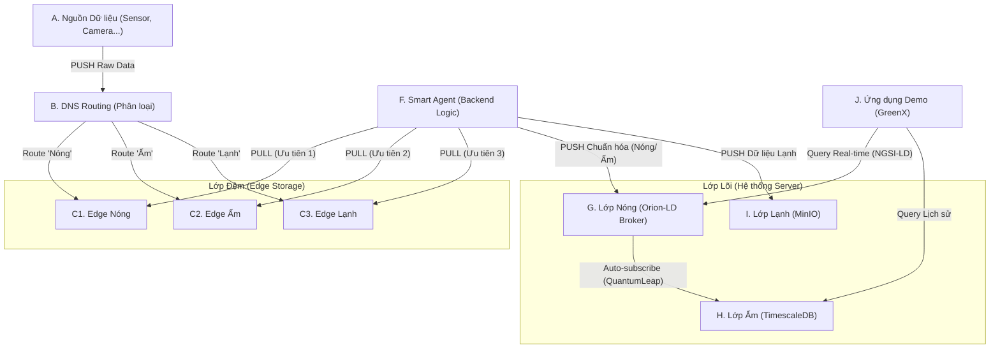

# SmartCity-Platform (Bài dự thi PMNM 2025)

**Đội:** Haui-HIT-NhoNguoiYeuCu
**Trường:** Trường Công Nghệ Thông Tin và Truyền Thông (SICT) - Đại Học Công Nghiệp Hà Nội

[](https://Haui-HIT-NhoNguoiYeuCu.github.io/SmartCity-Platform/)
[](./LICENSE)

Bài dự thi Xây dựng ứng dụng thành phố thông minh dựa trên nền tảng dữ liệu mở.

## 💡 Ý tưởng Cốt lõi

Dự án này xây dựng một **Nền tảng Dữ liệu Đô thị** (Urban Data Platform) có khả năng phục hồi cao, giải quyết vấn đề quá tải (ingestion overhead) trong Smart City.

Thay vì PUSH dữ liệu trực tiếp, kiến trúc của chúng tôi sử dụng mô hình 2 giai đoạn độc đáo:

1. **Phân loại (Route-then-Store):** Dữ liệu thô (raw data) được **DNS Routing** phân loại (Nóng/Ấm/Lạnh) và PUSH vào 3 kho đệm **Edge Storage** (NATS) riêng biệt.  
2. **Xử lý (PULL-then-Process):** Một **Smart Agent** (backend) sẽ **PULL** dữ liệu từ 3 kho đệm đó theo thứ tự ưu tiên (Nóng trước, Lạnh sau) để xử lý.

Kiến trúc này đảm bảo hệ thống không bao giờ sập, dữ liệu khẩn cấp được ưu tiên, và **tuân thủ 100% yêu cầu kỹ thuật** của đề bài (sử dụng NGSI-LD làm lõi).

## 🏗️ Kiến trúc Hệ thống

Sơ đồ dưới đây mô tả luồng dữ liệu "lai" (Hybrid) kết hợp giữa ý tưởng của đội và yêu cầu của đề bài:


## 🛠️ Công nghệ & Phụ thuộc (Tech Stack)

Nền tảng này sử dụng và tích hợp các PMMN sau:

- **Backend (Code):** Spring Boot 3 (Java) (Smart Agent)  
- **Hạ tầng (PMMN):**
  - **Lớp Đệm (Edge):** NATS.io (hoặc RabbitMQ)  
  - **Lớp Nóng (Core):** FIWARE Orion-LD (Tuân thủ NGSI-LD)  
  - **Lớp Ấm (History):** TimescaleDB + QuantumLeap  
  - **Lớp Lạnh (Storage):** MinIO  
- **Vận hành (Tiêu chí 4):** Docker & Docker Compose

## 🚀 Hướng dẫn Cài đặt

Hệ thống yêu cầu đã cài đặt Docker và Docker Compose.

**Clone kho mã nguồn:**
```bash
git clone https://github.com/Haui-HIT-NhoNguoiYeuCu/SmartCity-Platform.git
```

**Di chuyển vào thư mục dự án:**
```bash
cd SmartCity-Platform
```

**Biên dịch và khởi chạy toàn bộ nền tảng**  
(Lệnh này sẽ tự động build Smart Agent và khởi chạy mọi dịch vụ hạ tầng)
```bash
docker-compose up -d --build
```

## 🌐 Xem Giao diện Web (Ví dụ)

- **Giao diện GreenX (Demo):** http://localhost:3000 (Hoặc cổng bạn cấu hình)  
- **Orion-LD (Lớp Nóng API):** http://localhost:1026/ngsi-ld/v1/entities  
- **MinIO (Lớp Lạnh):** http://localhost:9001  
- **NATS Monitor (Lớp Đệm):** http://localhost:8222  

**Dừng hệ thống:**
```bash
docker-compose down
```

## 📚 Tài liệu Chi tiết

Tài liệu này chỉ là tổng quan. Toàn bộ mô tả chi tiết về Backend, Infrastructure, API, và hướng dẫn sử dụng đều có tại trang Docusaurus của dự án.

➡️ **Xem tài liệu đầy đủ tại đây:** https://Haui-HIT-NhoNguoiYeuCu.github.io/SmartCity-Platform/


## 🤝 Đóng góp cho Dự án

* **Báo lỗi ⚠️:** [Tạo một Bug Report](https://github.com/Haui-HIT-NhoNguoiYeuCu/open-linked-hub/issues/new?assignees=&labels=bug&template=bug_report.md&title=%5BBUG%5D)
* **Yêu cầu tính năng 👩‍💻:** [Đề xuất một tính năng mới](https://github.com/Haui-HIT-NhoNguoiYeuCu/open-linked-hub/issues/new?assignees=&labels=enhancement&template=feature_request.md&title=%5BFEAT%5D)

Nếu bạn muốn đóng góp cho dự án, hãy đọc `CONTRIBUTING.md` để biết thêm chi tiết.
Mọi đóng góp của các bạn đều được trân trọng, đừng ngần ngại gửi pull request cho dự án.

---

## 📞 Liên hệ

* **Nguyễn Huy Hoàng:** nguyenhuyhoangpt0402@gmail.com
* **Trần Danh Khang:** trandanhkhang482004@gmail.com
* **Nguyễn Huy Hoàng:** nguyenhuyhoangqbx5@gmail.com

---
## ⚖️ Giấy phép

Dự án này được cấp phép theo Giấy phép **Apache 2.0**. Xem chi tiết tại file [LICENSE](./LICENSE).
