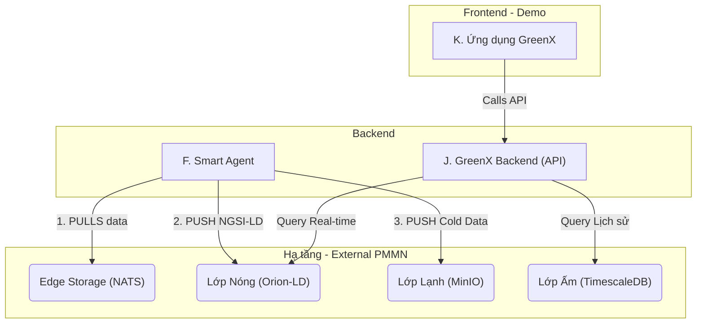

Phần **Backend** của **SmartCity-Platform** là (các) dịch vụ microservice do đội phát triển (viết bằng Spring Boot / Python). Dịch vụ này đóng vai trò là **\"bộ não\"** của toàn bộ hệ thống, thực thi logic nghiệp vụ quan trọng nhất để đáp ứng yêu cầu cuộc thi.

---

## 1. Mục tiêu 🎯

Mục tiêu của Backend (Smart Agent) là:

- **Chủ động PULL dữ liệu:** Là service *duy nhất* chủ động PULL dữ liệu từ Lớp Đệm (Edge Storage / NATS) theo thứ tự ưu tiên.
- **Xử lý Ưu tiên Thông minh:** Áp dụng logic nghiệp vụ phân loại **Nóng / Ấm / Lạnh** để quyết định PULL dữ liệu nào trước, xử lý dữ liệu nào sau.
- **Chuẩn hóa NGSI-LD (Yêu cầu Đề bài):** Chịu trách nhiệm chuyển đổi (transform) dữ liệu thô (JSON, text...) sang định dạng chuẩn **NGSI-LD** và sử dụng **FIWARE Smart Data Models**.
- **Phân phối Dữ liệu:**
    - **PUSH** dữ liệu đã chuẩn hóa (Nóng/Ấm) vào **Lớp Nóng (Orion-LD Broker)**.
    - **PUSH** dữ liệu thô (Lạnh) vào **Lớp Lạnh (MinIO)**.
- **Cung cấp API (Tùy chọn):** Xây dựng `GreenX-Backend` để cung cấp API đã được xử lý (ví dụ: `/api/charts`) cho ứng dụng demo.

---

## 2. Thiết kế hệ thống Backend 🏛️

Các dịch vụ Backend (mã nguồn của đội) tương tác với các dịch vụ Hạ tầng (PMMN) như sau:

- **Smart Agent:** Dịch vụ lõi, thực thi logic PULL, chuẩn hóa và PUSH.
- **GreenX-Backend:** Dịch vụ API, đọc dữ liệu từ Lớp Nóng (Orion) và Lớp Ấm (TimescaleDB) để phục vụ Frontend.



---

## 3. Cấu trúc dự án Backend 📁

Tất cả mã nguồn Backend và Hạ tầng được quản lý trong cùng một kho Git.

```
smartcity-platform/
├── smart-agent/          # Service PULL & Xử lý Ưu tiên (Spring Boot)
│   ├── src/
│   ├── Dockerfile
│   └── pom.xml
├── greenx-backend/       # (Tùy chọn) Service API cho GreenX
│   ├── src/
│   ├── Dockerfile
│   └── pom.xml
├── sensor-simulator/     # (Tùy chọn) Script giả lập sensor PUSH dữ liệu
│   └── simulator.py
├── docs/                 # Thư mục chứa Docusaurus
└── docker-compose.yml    # File lõi: Khởi chạy TOÀN BỘ hệ thống (Hạ tầng + Backend)
```

---

## 4. Cài đặt & Chạy dự án Backend 🚀

### Yêu cầu

- **Java Development Kit (JDK):** ≥ 17  
- **Apache Maven:** ≥ 3.8.x  
- **Docker & Docker Compose:** Phiên bản mới nhất  

### Cài đặt & Chạy (Tiêu chí 4)

```bash
# 1. Clone repository (sửa lại link repo của đội)
git clone https://github.com/<Ten-Owner>/SmartCity-Platform.git
cd SmartCity-Platform

# 2. Build các module backend (Smart Agent, GreenX Backend)
# (Docker Compose cũng sẽ làm điều này nếu được cấu hình build)
mvn clean install -DskipTests

# 3. Khởi chạy toàn bộ hệ thống (Bao gồm Hạ tầng + Backend)
docker-compose up --build -d
```

### Các cổng dịch vụ (Backend & Demo)

- **Smart Agent (Actuator):** http://localhost:8080/actuator/health  
- **GreenX Backend (API Swagger):** http://localhost:8081/swagger-ui.html  
- **GreenX Demo App (Frontend):** http://localhost:3000  
